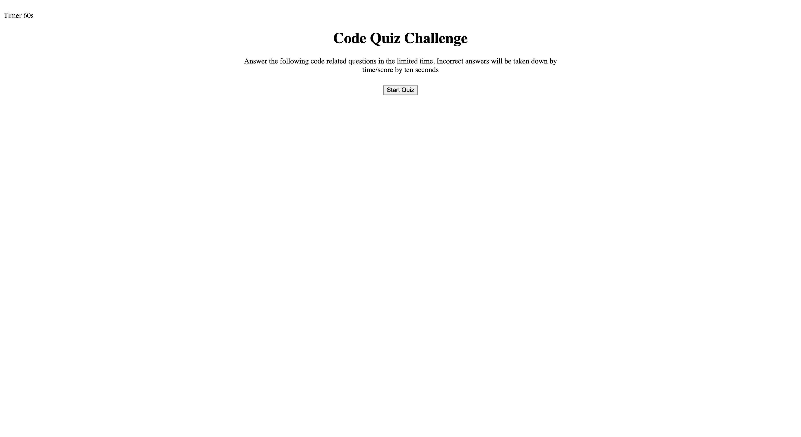

# Code Quiz

## Description
This is a quiz challenge, which includes a series of multiple-choice questions and is timed.There is a limited amount of time to answer each question, and incorrect answers will result in a deduction of time from the total.

In this challenge, I have used learned about javascript codes.

## Installation

To install this project:
1. Run
`git clone git@github.com:SanaS7/codequiz.git`

2. Open the folder on your preferred code editor.

## Usage

## Credits

Sana Sadiq

## License

This project is licensed under the [MIT License](https://opensource.org/license/mit/).
